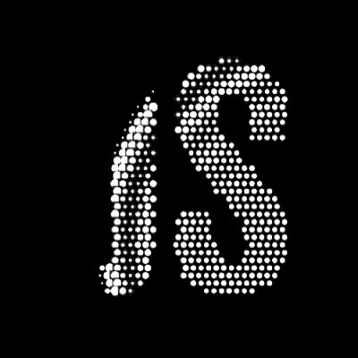
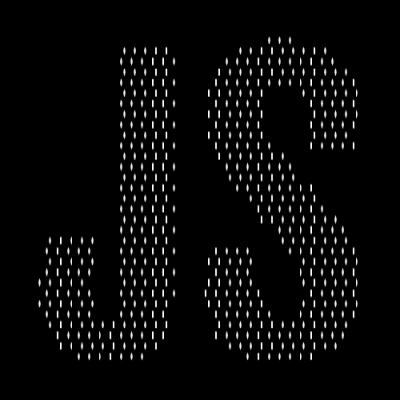

# TypographyDot

A project to show how many animation effects can be shown in HTML5. This project is packaged as a library with webpack to reuse more easier.

Click anywhere on the screen, then text is drawn from this location, and when moving the mouse over the text the letter activates.

## How to use

Write a font name and a text which should be written in the constructor of `DotKineticText(fontName, text)` and call animate on this instance recursively with `window.requestAnimationFrame()`.

```js
const fontName = 'Arial';
const text = 'JS';
const fotKineticText = new DotKineticText(fontName, text);
fotKineticText.resize();
window.requestAnimationFrame(animate);

function animate(curTime) {
  fotKineticText.animate(curTime);
  window.requestAnimationFrame(animate);
}
```

## Used tools

- HTML5
- CSS3
- JavaScript

## Overview

  
  
  

## Page

https://tokenkim92.github.io/TypographyDot/
